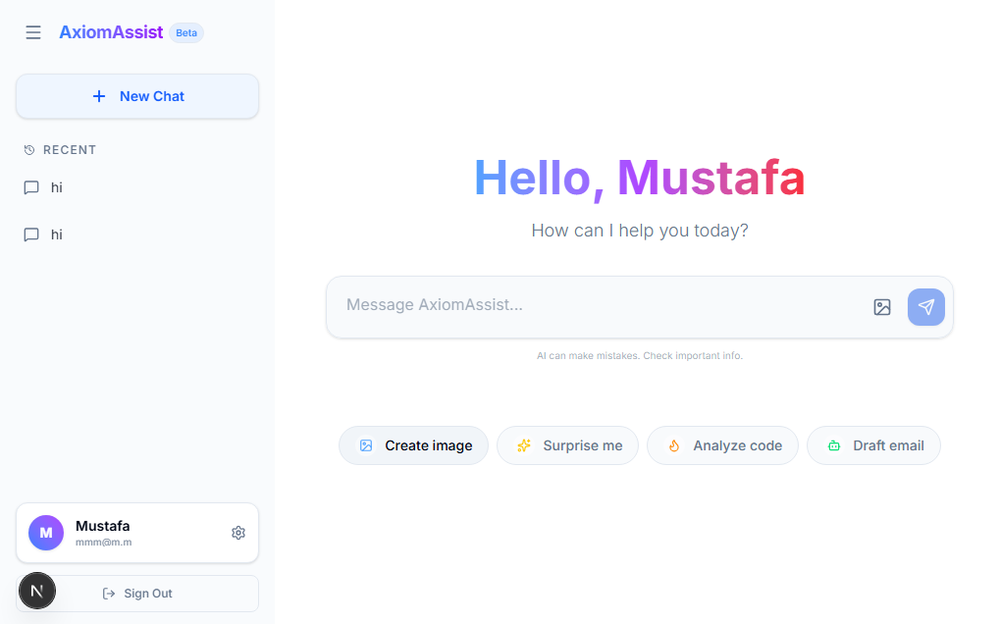

# <div align="center">AxiomAssist 🚀</div>

<div align="center">
  <span style="font-size: 1.2em; font-weight: bold;">Your Next-Gen AI Companion • Interactive • Intelligent • Friendly</span>
</div>

<br />

<div align="center">
  
</div>

<br />

## ✨ Overview

**AxiomAssist** is not just another chatbot—it's a **digital best friend** designed to bridge the gap between AI and human connection. Built with the cutting-edge **Next.js 15**, this application features a warm, engaging persona that helps users with everything from complex problem-solving to casual conversation.

Combining powerful **AI capabilities** with a **premium, glassmorphism-inspired UI**, AxiomAssist demonstrates the potential of modern web development. It's fully responsive, visually stunning, and packed with real-world utilities.

---

## 💎 Key Features

### 🤖 **Empathetic AI Persona**

- **More Human, Less Robot**: Programmed to be warm, funny, and supportive using custom system prompts.
- **Context Aware**: Remembers your previous conversations for a continuous changelog.

### 👁️ **Vision & Multimodal Support**

- **Image Analysis**: Upload images and let AxiomAssist analyze, describe, or answer questions about them.
- **Seamless Integration**: Drag-and-drop interface for easy media sharing.

### 🛠️ **Real-World Agentic Tools**

- **Live Weather**: "What's the weather in Tokyo?" — Get real-time data.
- **Currency Converter**: Instant financial conversions.
- **Recipe Generator**: Custom culinary suggestions based on ingredients you have.

### 🔐 **Secure & Robust**

- **Full Authentication**: Secure signup and login systems using `NextAuth.js`.
- **Database Storage**: Chat history is persistently stored in **MongoDB**.

---

## 🏗️ Tech Stack

This project leverages the latest in web technology to ensure performance, scalability, and developer experience.

| Category           | Technologies                                                                                                                                            |
| :----------------- | :------------------------------------------------------------------------------------------------------------------------------------------------------ |
| **Framework**      |  <sub>App Router (Server Actions)</sub>                |
| **Styling**        |  <sub>+ Framer Motion for Animations</sub> |
| **AI Integration** |  <sub>Prompt Engineering & Streaming</sub>    |
| **Database**       |  <sub>Mongoose ODM</sub>                                 |
| **Auth**           |  <sub>Secure Session Management</sub>                |
| **Language**       |  <sub>Strict Typing</sub>                       |

---

## 🚀 Getting Started

Want to run this locally? Follow these simple steps:

1.  **Clone the Repository**

    ```bash
    git clone https://github.com/mmustafacode/AxiomAssist.git
    cd AxiomAssist
    ```

2.  **Install Dependencies**

    ```bash
    npm install
    # or
    yarn install
    ```

3.  **Configure Environment**
    Create a `.env.local` file in the root directory and add your keys:

    ```env
    MONGODB_URI=your_mongodb_connection_string
    NEXTAUTH_SECRET=your_secret_key
    OPENAI_API_KEY=your_openai_key # or other provider keys
    ```

4.  **Run the App**
    ```bash
    npm run dev
    ```
    Open [http://localhost:3000](http://localhost:3000) to view it in the browser.

---

## 🎨 Design Philosophy

Currently, the design follows a **"Deep Cosmos"** aesthetic:

- **Glassmorphism**: Translucent cards and blurred backgrounds.
- **Gradients**: Rich blues, purples, and pinks to evoke a sense of modernism and magic.
- **Micro-interactions**: Subtle animations (blobs, hovers, fades) that make the UI feel "alive".

---

## 👨‍💻 Author

**Mustafa**
_Full Stack Developer & AI Enthusiast_

If you like this project, don't forget to give it a ⭐️!
i
